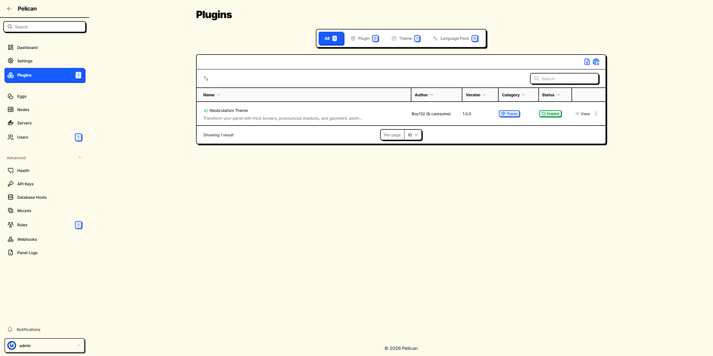
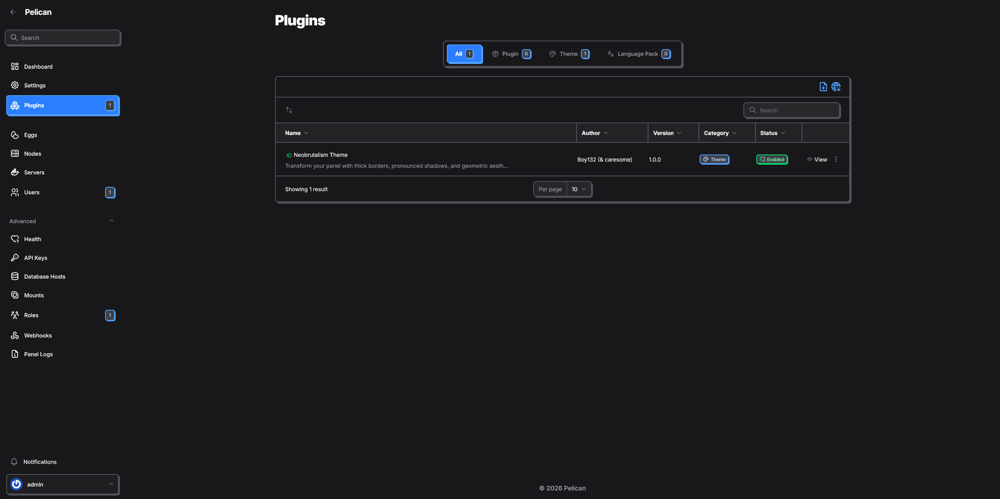

# Neobrutalism Theme (by Boy132)

Transform your panel interface with thick borders, pronounced shadows, and geometric aesthetics inspired by the neobrutalism design movement.

_Originally created by [Ankit Thapa](https://github.com/caresome) as [Filament Theme](https://github.com/caresome/filament-neobrutalism-theme), under MIT License._

## Preview

